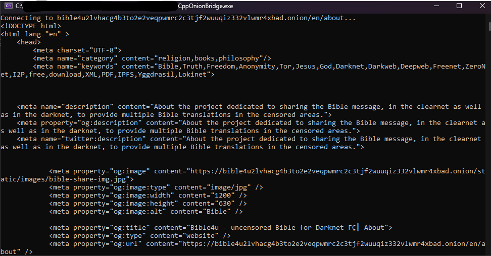

# CppOnionBridge

## Introduction
**CppOnionBridge** is a C++ project enabling secure access to onion sites and APIs over Tor using SOCKS5, specifically designed for Windows environments. This project simplifies making GET and POST requests to services that accept connections through SOCKS5, ensuring anonymity and security for users and developers alike.

## Compatibility
CppOnionBridge is specifically designed to interact with sites and services that accept SOCKS5 connections. This means that it will only work for making requests to endpoints that support this protocol, providing a secure and anonymous way to access onion sites over the Tor network.

## Dependencies
- Boost: Used for network and system operations.
- OpenSSL: Required for secure SSL/TLS connections.

## Installation
Before integrating **CppOnionBridge** into your project, ensure you have Boost and OpenSSL installed and configured on your system. Also, the Tor service must be running and set to connect through port 9150. For custom port configurations, modify the port in the `open_socket_SSL` function within the `connection.hpp` file.

1. Clone the repository:
   ```
   git clone https://github.com/dano20zombie/CppOnionBridge.git
   ```
2. Include the `connection.hpp` file in your project.
3. Ensure Tor is running on port 9150 or adjust the port accordingly in the code.

## Usage
The main focus of **CppOnionBridge** is to provide an easy way to make GET and POST requests to onion sites. Here is a basic example using the `connection_` class to make a GET request:

```cpp
#include "connection.hpp"

int main() {
    std::string response;
    connection.make_get("exampleonionsite.onion", "/api/path", "", response);

    std::cout << "Response: " << response << std::endl;
    return 0;
}
```
Replace `"exampleonionsite.onion"` and `"/api/path"` with the onion site and API endpoint you wish to access.

## Results
Below is an image showing the result of a test connection made using **CppOnionBridge**:



## Contributing
I welcome any contributions from the community! If you have suggestions for improvements or bug fixes, please feel free to open an issue or submit a pull request.

## License
**CppOnionBridge** is released under the MIT License. See the LICENSE file in the repository for more information.